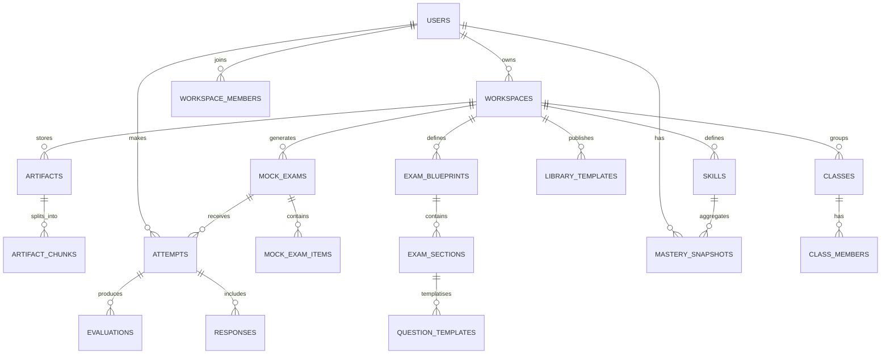
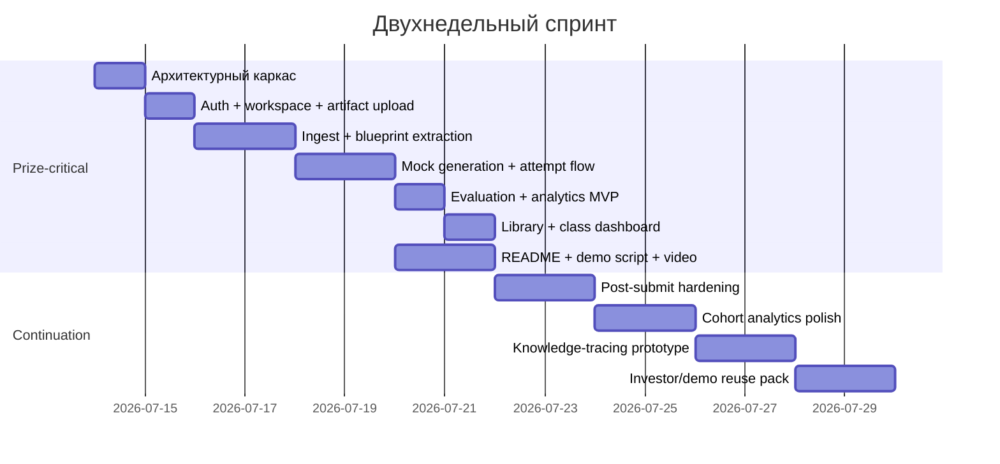
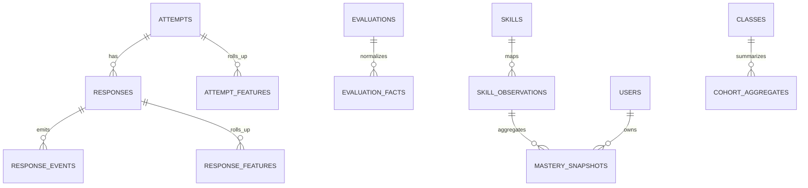
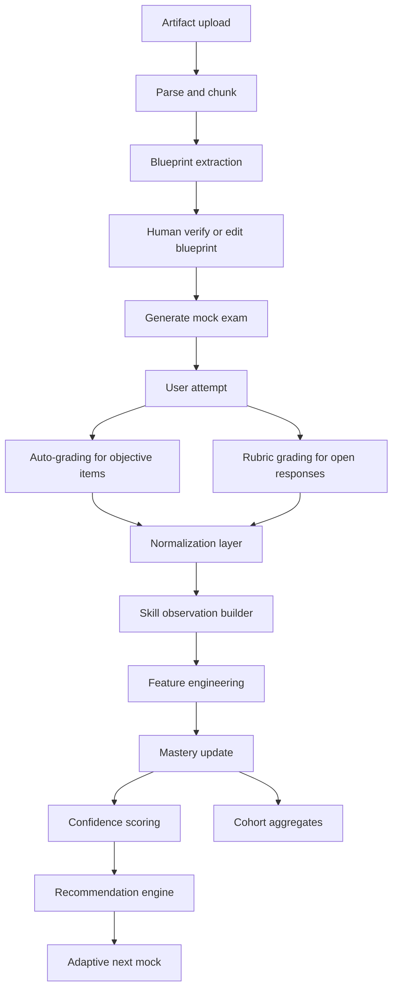

# Аналитический отчёт по student-owned adaptive exam-prep platform

## Исполнительное резюме

Идея платформы выглядит конкурентоспособной для трека **Education** только в том случае, если она будет подана не как «ещё один AI study dashboard», а как **student-owned adaptive exam-prep network**: студенты загружают реальные артефакты курса и экзамена, система извлекает структуру экзамена, генерирует реалистичные mock exams, оценивает попытки, строит skill-level аналитику, создаёт следующий адаптивный mock и даёт возможность клонировать готовые spaces между потоками и университетами. Такое позиционирование лучше соответствует критериям Build Week, где после pass/fail-базового отбора проект оценивается по четырём **равновесным** критериям: Technological Implementation, Design, Potential Impact и Quality of the Idea. Tie-break идёт в том же порядке, поэтому технический критерий фактически самый важный при равных итоговых баллах. Для submission обязательны runnable-проект, публичное или открытое судье приватное репо, README с объяснением роли Codex/GPT-5.6, `/feedback` Codex Session ID и видео короче трёх минут на YouTube. citeturn12view0turn13view0turn13view1turn13view3turn23view1

Ключевой риск идеи в том, что **Quizlet уже закрывает значимую часть поверхности продукта**. Официальные материалы Quizlet показывают, что он уже умеет генерировать AI-powered Practice Tests из загруженных конспектов и наборов, задавать количество вопросов, типы вопросов и лимит времени; Learn строит персонализированный study path; Classes позволяют делиться наборами и отслеживать прогресс; Class Progress показывает активность, лучшие баллы и часто пропускаемые термины; Ask Quizlet даёт объяснения, “grounded in what they’re studying”. Поэтому качество идеи нельзя поднимать только интерфейсом или формулировкой. Рост Quality of the Idea должен опираться на реально другой продуктовый цикл: **exam digital twin + repeated skill analytics + adaptive next mock + clonable university spaces + student-owned class network**. citeturn14view0turn14view2turn14view3turn14view4turn15search0turn15search6

С инженерной точки зрения для Build Week лучшее решение — не раздувать платформу, а собрать **один полностью работающий вертикальный сценарий**. Рекомендованная архитектура для MVP: Next.js App Router + React + TypeScript на фронтенде; FastAPI + Pydantic + SQLAlchemy + PostgreSQL `jsonb` + `pgvector` на бэкенде; S3-совместимое хранилище для артефактов; Redis + Dramatiq или Celery для фоновых задач; GitHub Actions для CI/CD; OpenAI Responses/Embeddings/Moderation для generation, evaluation, retrieval и safety. У такого стека есть два плюса, которые особенно важны для хакатона: он позволяет держать большинство данных и бизнес-логики в одном основном контуре, а также минимизирует число сервисов, от которых зависит demo. PostgreSQL `jsonb` быстрее в обработке и индексируется; `pgvector` поддерживает exact nearest neighbor search, а также approximate indexing через HNSW и IVFFlat; S3 по умолчанию шифрует новые загрузки; presigned URLs позволяют не проксировать большие файлы через приложение; FastAPI обеспечивает рабочие OAuth2/JWT и scope-based authorization; GitHub Actions даёт стандартный CI/CD и поддерживает OIDC для деплоя без long-lived cloud secrets. citeturn20view0turn19view0turn19view1turn19view3turn4search0turn4search5turn6search0turn6search10turn3search0turn3search2turn3search14

Для оценки шансов на приз главная рекомендация практическая: **не строить одновременно “Notion + Quizlet + Duolingo + LMS”**. В призовом формате судьи увидят не глубину vision deck, а рабочий E2E-flow. Наиболее сильный demo-сценарий для этого проекта: студент A загружает прошлый экзамен и rubric, система извлекает blueprint, генерирует mock, студент проходит попытку, получает skill-analysis и adaptive next mock, затем публикует space в library, студент B его клонирует, а class dashboard показывает прогресс группы. Такой flow одновременно закрывает Design, Tech, Impact и Idea, а также укладывается в правило короткого видео. citeturn12view1turn13view0turn13view2

## Продуктовая рамка и ограничения хакатона

Самая важная продуктовая развилка — **не копировать Quizlet 1:1 под капотом и в подаче**. Официальные документы Quizlet подтверждают, что он уже покрывает загружаемые материалы, AI practice tests, adaptive study path, class organization, class progress и grounded explanations. Это означает, что без явного отличия судья легко отнесёт проект к категории “another AI exam prep wrapper”. citeturn14view0turn14view2turn14view3turn14view4turn15search0

Отсюда следует продуктовая позиция, которую имеет смысл фиксировать в лендинге, README и видео:

> **Student-owned adaptive exam-prep platform that reconstructs real exam formats, tracks mastery across repeated simulations, and lets students clone and improve university course spaces together.**

Эта формулировка опирается на реальные зазоры относительно Quizlet. Quizlet генерирует questions из материалов и помогает изучать content; ваш проект должен помочь **сдать конкретный экзамен**, а не просто повторять материал. Это требует четырёх отличий. Первое — **exam digital twin**, то есть не question generation “по теме”, а извлечение структуру конкретного экзамена: sections, types, timing, scoring, penalties, rubrics. Второе — **longitudinal skill analytics**, где система отслеживает не “какие термины чаще пропускаются”, а mastery по навыкам в динамике нескольких mock attempts. Третье — **adaptive next mock**, где новая попытка строится вокруг подтверждённых слабых навыков, а не только вокруг контента. Четвёртое — **clonable university spaces**, ближе к Notion templates или GitHub repositories, чем к одиночным flashcard sets. Эти различия — не просто маркетинг; они нужны именно потому, что Build Week отдельно оценивает Quality of the Idea и Potential Impact относительно уже существующих решений. citeturn14view3turn12view1

С точки зрения правил OpenAI/Devpost проект обязан быть **runnable**, соответствовать категории, явно показывать реальную роль Codex и GPT-5.6, иметь работающий judge-access path и корректную работу с third-party materials. Для private repository судьи должны получить доступ через `testing@devpost.com` и `build-week-event@openai.com`; Devpost plugin факультативен, submission можно целиком делать через сайт; использование сторонних SDK, API и данных допустимо только при наличии права на их использование. Это напрямую влияет на продуктовую спецификацию: community library должна предусматривать флаги public/private, ownership, moderation, reporting и явное подтверждение того, что пользователь имеет право публиковать материалы. Иначе вы получаете не growth loop, а юридическую мину. citeturn12view4turn13view0turn13view3

Ниже — короткая визуальная схема того, каким должен быть **правильный вертикальный сценарий MVP**:


## Артефакт полного ТЗ платформы

### Цель и рамка MVP

Цель MVP — показать один законченный учебный цикл: создание study space, загрузка артефактов, извлечение blueprint, генерация mock exam, прохождение попытки, разбор слабых навыков, публикация или клонирование space, просмотр class dashboard. Такой scope лучше всего соответствует правилам Build Week, которые требуют runnable product, понятную демонстрацию, описание роли Codex в README и короткое публичное demo-video. citeturn13view0turn13view1turn12view5

### Рекомендуемая архитектура

Рекомендованный стек для hackathon-MVP:

- **Frontend**: Next.js App Router, React, TypeScript, Tailwind, shadcn/ui, TanStack Query, Recharts или ECharts.
- **Backend**: FastAPI, Pydantic, SQLAlchemy, PostgreSQL, `pgvector`.
- **Storage**: S3-совместимое object storage для PDF/DOCX/images.
- **Queue**: Redis + Dramatiq для MVP; Celery — если нужен более тяжёлый orchestration.
- **AI**: OpenAI Responses API для generation/evaluation, Embeddings для retrieval, Moderation для community uploads и generated text.
- **CI/CD**: GitHub Actions, environment-specific secrets, OIDC to cloud.
- **Runtime**: Docker; один API service, один worker service, один web service, один Postgres, один Redis, один bucket.

Эта конфигурация — инженерный вывод, а не только вкусовое предпочтение. Она хорошо соответствует и требованиям runnable demo, и срокам Build Week, и способности PostgreSQL держать одновременно относительную схему, `jsonb` и vector search. `jsonb` хранится в бинарном декомпозированном формате, быстрее в обработке и поддерживает indexing; `pgvector` даёт и exact nearest neighbor search, и approximate alternatives HNSW/IVFFlat; OpenAI vector stores тоже доступны как управляемый retrieval-layer, но для MVP они добавляют ещё один внешний контур, который необязателен, если вы уже используете Postgres. citeturn20view0turn20view1turn19view0turn19view1turn19view3turn21view0turn21view3

### Сравнение опций базы данных

| Опция | Где сильна | Где слаба | Рекомендация |
|---|---|---|---|
| **PostgreSQL + `jsonb` + `pgvector`** | Один OLTP-контур для users, attempts, blueprints и retrieval; `jsonb` индексируется и быстрее в обработке, `pgvector` поддерживает exact search, HNSW и IVFFlat. citeturn20view0turn19view0turn19view1turn19view3 | Не идеальна для очень тяжёлой cohort analytics на больших объёмах | **Основной выбор для MVP** |
| **PostgreSQL + DuckDB sidecar** | DuckDB — in-process SQL OLAP engine с columnar storage; есть postgres extension для чтения Postgres напрямую. Это хорошо для nightly analytics без отдельного кластера. citeturn17search0turn17search2turn17search10 | Ещё один аналитический слой, который нужно встроить в пайплайн | Подключать на втором шаге |
| **PostgreSQL + ClickHouse** | ClickHouse — column-oriented OLAP DBMS с очень высокой скоростью аналитики и ingest. citeturn17search1turn17search3turn17search9 | Слишком тяжёл для Build Week MVP, дополнительный ops burden | Только при росте после хакатона |

### Сравнение опций очередей задач

| Опция | Где сильна | Где слаба | Рекомендация |
|---|---|---|---|
| **FastAPI BackgroundTasks** | Очень быстро стартует; полезно для простых post-response jobs. citeturn5search2turn5search6 | Не полноценная распределённая очередь; docs отдельно рекомендуют держать такие задачи независимыми по ресурсам. citeturn5search18 | Только для совсем лёгких задач |
| **Dramatiq + Redis** | Документация подчёркивает simplicity, reliability и performance; worker CLI предельно простой. citeturn5search1turn5search5turn5search13 | Меньше ready-made ecosystem, чем у Celery | **Лучший выбор для MVP** |
| **Celery + Redis/RabbitMQ** | Mature task queue, scheduling, retries, distributed processing. citeturn5search0turn5search8turn5search20 | Больше конфигурации и cognitive overhead | Хорош для post-MVP |

### Сравнение опций retrieval/vector storage

| Опция | Где сильна | Где слаба | Рекомендация |
|---|---|---|---|
| **`pgvector` в Postgres** | Exact search по умолчанию, approximate HNSW/IVFFlat при необходимости, всё в одной БД. citeturn19view0turn19view1turn19view3 | Нужно самим строить chunking/ranking/filtering слой | **Основной выбор** |
| **OpenAI Retrieval / vector stores** | Автоматическое chunking, embedding, indexing; semantic search и attribute filtering встроены. citeturn21view0turn21view1turn21view4 | Внешний managed retrieval-layer, отдельная стоимость и меньше контроля над хранением | Хорош для fast prototype retrieval |
| **Pinecone / Weaviate** | Специализированные vector DB, metadata filtering и multitenancy/collection model. citeturn16search0turn16search8turn16search10turn16search1turn16search3 | Отдельная инфраструктура и интеграция, перегруз для Build Week | Не нужен в MVP |

### Сравнение фронтенд-библиотек

| Компонент | Опция | Плюс | Минус | Рекомендация |
|---|---|---|---|---|
| Router / rendering | **Next.js App Router** | Server + Client Components, удобный full-stack routing. citeturn6search2turn6search7turn6search17 | Порог входа выше, чем у чистого SPA | **Да** |
| Server state | **TanStack Query** | Даёт cache, retries, lifecycle и declarative APIs для server state. citeturn6search3turn6search18 | Нужно дисциплинированно проектировать keys/invalidation | **Да** |
| UI kit | **shadcn/ui** | Accessible open-code components, удобно быстро собрать polished UX. citeturn6search4turn6search9 | Не “готовая библиотека”, а скорее foundation | **Да** |
| Charts | **Recharts** | React-first, быстро для MVP dashboard. citeturn18search0turn18search2 | Меньше гибкости на сложных analytics views | Для MVP |
| Charts | **Apache ECharts** | >20 chart types, data transforms, heavy interactive analytics. citeturn18search1turn18search8 | Выше сложность и API surface | Для post-MVP advanced analytics |

### Модель данных и сущности

Ниже — рекомендуемая доменная модель. Важнейшее решение: **не пытаться жёстко захардкодить “английский экзамен”**. Поддержка “IELTS → quantum physics” достигается за счёт комбинации relational core + `jsonb`-описаний blueprint/rubric/config. PostgreSQL прямо рекомендует `jsonb` для большинства приложений, где нужна гибкость и предсказуемая структура без полного отказа от relational model. citeturn20view0

#### Основные сущности

| Сущность | Назначение | Ключевые поля |
|---|---|---|
| `users` | аккаунты | `id`, `email`, `password_hash`, `display_name`, `avatar_url`, `created_at` |
| `workspaces` | study space / course space | `id`, `owner_id`, `title`, `university`, `course_code`, `subject`, `visibility`, `target_exam_date` |
| `workspace_members` | роли в workspace | `workspace_id`, `user_id`, `role` |
| `artifacts` | загруженные файлы | `id`, `workspace_id`, `kind`, `storage_key`, `mime`, `source_type`, `is_public`, `license_note` |
| `artifact_chunks` | chunks для retrieval | `id`, `artifact_id`, `chunk_index`, `text`, `embedding`, `attributes_jsonb` |
| `exam_blueprints` | extracted exam spec | `id`, `workspace_id`, `version`, `status`, `config_jsonb` |
| `exam_sections` | нормализованные секции | `id`, `blueprint_id`, `name`, `order_no`, `section_type`, `time_limit_sec`, `score_weight` |
| `skills` | skill taxonomy | `id`, `workspace_id`, `code`, `name`, `parent_skill_id` |
| `question_templates` | plan/question archetypes | `id`, `section_id`, `question_type`, `config_jsonb`, `difficulty`, `skills_jsonb` |
| `mock_exams` | generated mock | `id`, `workspace_id`, `blueprint_id`, `generator_config_jsonb`, `status` |
| `mock_exam_items` | вопросы в mock | `id`, `mock_exam_id`, `question_type`, `prompt_jsonb`, `answer_key_jsonb`, `skills_jsonb`, `points` |
| `attempts` | попытки пользователя | `id`, `mock_exam_id`, `user_id`, `started_at`, `submitted_at`, `score_raw`, `score_norm` |
| `responses` | ответы на item | `id`, `attempt_id`, `item_id`, `response_jsonb`, `latency_ms`, `client_events_jsonb` |
| `evaluations` | результаты проверки | `id`, `attempt_id`, `item_id`, `result_jsonb`, `confidence`, `rubric_jsonb` |
| `mastery_snapshots` | агрегаты по навыкам | `id`, `workspace_id`, `user_id`, `skill_id`, `mastery`, `confidence`, `n_obs`, `updated_at` |
| `study_recommendations` | next-step рекомендации | `id`, `user_id`, `workspace_id`, `kind`, `payload_jsonb`, `active_until` |
| `library_templates` | community library entry | `id`, `workspace_id`, `published_by`, `visibility`, `clone_count`, `metadata_jsonb` |
| `classes` | группы / clan / class | `id`, `workspace_id`, `name`, `owner_id`, `privacy_mode` |
| `class_members` | участники class | `class_id`, `user_id`, `nickname`, `leaderboard_opt_in` |

#### Mermaid ER-диаграмма



### REST API

Ниже приведён рекомендуемый REST layer. Для MVP достаточно JSON API; GraphQL здесь не даёт ценности. Pydantic models естественно подходят как endpoint schemas, а FastAPI/Pydantic/SQLAlchemy уже хорошо согласуются по типизированной модели. citeturn6search1turn5search10turn5search7

#### Auth и профиль

| Метод | Endpoint | Назначение | Auth |
|---|---|---|---|
| `POST` | `/auth/register` | регистрация | public |
| `POST` | `/auth/login` | login → access/refresh JWT | public |
| `POST` | `/auth/refresh` | refresh access token | refresh |
| `POST` | `/auth/logout` | revoke refresh | user |
| `GET` | `/me` | профиль текущего пользователя | user |
| `PATCH` | `/me` | update display name/avatar | user |

#### Workspaces и library

| Метод | Endpoint | Назначение |
|---|---|---|
| `GET` | `/workspaces` | список доступных spaces |
| `POST` | `/workspaces` | создать space |
| `GET` | `/workspaces/{id}` | получить space |
| `PATCH` | `/workspaces/{id}` | обновить metadata |
| `POST` | `/workspaces/{id}/clone` | клонировать из library |
| `POST` | `/workspaces/{id}/publish` | опубликовать в library |
| `GET` | `/library` | browse community library |
| `GET` | `/library/{template_id}` | карточка template |
| `POST` | `/library/{template_id}/clone` | clone to my workspace |

#### Артефакты и retrieval

| Метод | Endpoint | Назначение |
|---|---|---|
| `POST` | `/workspaces/{id}/artifacts/presign-upload` | получить presigned URL |
| `POST` | `/workspaces/{id}/artifacts/complete` | завершить upload и создать запись |
| `GET` | `/workspaces/{id}/artifacts` | список артефактов |
| `DELETE` | `/artifacts/{artifact_id}` | удалить артефакт |
| `POST` | `/artifacts/{artifact_id}/process` | отправить в parse/chunk/embed |
| `POST` | `/workspaces/{id}/search` | retrieval по chunk-индексу |

#### Blueprints, mocks и attempts

| Метод | Endpoint | Назначение |
|---|---|---|
| `POST` | `/workspaces/{id}/blueprints/extract` | извлечь blueprint из артефактов |
| `GET` | `/workspaces/{id}/blueprints/current` | текущий blueprint |
| `PATCH` | `/blueprints/{id}` | вручную отредактировать blueprint |
| `POST` | `/workspaces/{id}/mocks` | сгенерировать mock exam |
| `GET` | `/mocks/{id}` | получить mock |
| `POST` | `/mocks/{id}/attempts` | начать attempt |
| `PATCH` | `/attempts/{id}/responses/{item_id}` | autosave ответа |
| `POST` | `/attempts/{id}/submit` | submit и enqueue evaluation |
| `GET` | `/attempts/{id}/results` | результаты проверки |
| `POST` | `/attempts/{id}/adaptive-next` | следующий adaptive mock |

#### Classes и social layer

| Метод | Endpoint | Назначение |
|---|---|---|
| `POST` | `/workspaces/{id}/classes` | создать class |
| `POST` | `/classes/{id}/invite` | инвайт |
| `POST` | `/classes/{id}/join` | вступить |
| `GET` | `/classes/{id}/leaderboard` | leaderboard |
| `GET` | `/classes/{id}/dashboard` | cohort analytics |
| `PATCH` | `/classes/{id}/members/{user_id}` | nickname / opt-in / role |

### Примеры Pydantic data models

```python
from typing import Literal, Any
from pydantic import BaseModel, Field
from uuid import UUID
from datetime import datetime

class WorkspaceCreate(BaseModel):
    title: str
    university: str | None = None
    course_code: str | None = None
    subject: str | None = None
    visibility: Literal["private", "team", "public"] = "private"

class ArtifactComplete(BaseModel):
    filename: str
    mime_type: str
    storage_key: str
    kind: Literal["exam_pdf", "rubric", "notes", "solutions", "syllabus", "other"]
    source_type: Literal["upload", "clone", "library"]

class BlueprintSectionConfig(BaseModel):
    section_type: str
    order_no: int
    time_limit_sec: int | None = None
    score_weight: float = 1.0
    config: dict[str, Any] = Field(default_factory=dict)

class MockGenerationRequest(BaseModel):
    blueprint_id: UUID
    mode: Literal["full_exam", "section_only", "adaptive"] = "full_exam"
    target_skills: list[str] = Field(default_factory=list)
    difficulty: Literal["easy", "mixed", "hard"] = "mixed"
    duration_minutes: int | None = None
    item_count: int | None = None

class AttemptSubmit(BaseModel):
    submitted_at: datetime
    client_time_spent_sec: int
```

### Auth и authorization

FastAPI официально документирует рабочую схему OAuth2 Password + Bearer JWT, а также scope-based authorization. Для MVP этого достаточно. Рекомендуемая модель: access token 15 минут, refresh token 30 дней, ротация refresh, revocation list в Redis, server-side role checks по workspace/class membership. Scopes: `workspace:read`, `workspace:write`, `artifact:read`, `artifact:write`, `class:manage`, `library:publish`, `admin:moderate`. citeturn6search0turn6search10turn6search15

Практический вывод для privacy: загрузка артефактов должна быть **private by default**, а download/upload файлов — через S3 presigned URLs. AWS прямо указывает, что объекты S3 по умолчанию приватны, а presigned URLs дают time-limited access без раскрытия bucket permissions; все новые объекты в S3 шифруются at rest по умолчанию через SSE-S3. Для production можно перейти на SSE-KMS, но для hackathon demo достаточно и безопасно оставить SSE-S3 плюс bucket policy. citeturn4search1turn4search5turn4search13turn4search0turn4search12

### Task queue и job orchestration

Фоновая очередь нужна минимум для пяти вещей: document parsing, chunking/embedding, blueprint extraction, mock generation и evaluation. FastAPI BackgroundTasks подходит только для совсем лёгких post-response операций; документация отдельно советует держать background logic независимой по ресурсам. Поэтому для MVP имеет смысл вынести тяжёлые задачи в отдельный worker. Самый прагматичный выбор — **Dramatiq + Redis**: он проще по entry-cost, чем Celery, и достаточно надёжен для hackathon scale. Если нужен более богатый orchestration, можно перейти на Celery. citeturn5search2turn5search18turn5search1turn5search5turn5search0turn5search8

Рекомендуемые очереди:

- `artifact_ingest`
- `embedding_jobs`
- `blueprint_jobs`
- `mock_generation_jobs`
- `evaluation_jobs`
- `analytics_jobs`
- `moderation_jobs`

### Third-party integrations

#### OpenAI / Codex

Рекомендуемый runtime-path:

- **Responses API**: генерация mock exams, rubric-based feedback, study recommendations.
- **Embeddings**: semantic search по artifacts/chunks; OpenAI описывает embeddings как relatedness representation для search, clustering, recommendations и classification. citeturn10view1
- **Moderation**: community uploads descriptions, public comments, generated text shown to users; OpenAI moderation умеет классифицировать text/image inputs и выдавать scores, а safety docs рекомендуют moderation и human oversight, особенно в high-stakes domains. citeturn10view5turn11view1turn11view2
- **Codex for development**: README должен явно описать, где Codex ускорил работу, а submission должен включать `/feedback` Session ID. Это не runtime-фича платформы, а требование submission package. citeturn12view5turn13view0

#### GitHub / Devpost

Build Week **не требует** прямой Devpost API integration; plugin optional, website — source of truth. Поэтому для MVP не стоит строить глубокую Devpost-интеграцию. Вместо этого нужно сделать **submission helper** внутри приложения или репозитория:

- README template generator;
- checklist: repo visibility, judge credentials, demo account;
- export project metadata для Devpost формы;
- reminder о private repo access (`testing@devpost.com`, `build-week-event@openai.com`);
- хранение ссылки на YouTube demo и Codex Session ID.

Это самый экономный путь, соответствующий официальным правилам. citeturn12view4turn13view0turn13view1

### Security, privacy и moderation

Безопасность и privacy здесь не косметика, потому что платформа работает с файлами, оценками и potentially-student PII. Рекомендуемый минимум:

- private-by-default workspace visibility;
- encrypted object storage;
- presigned upload/download;
- row-level access checks по workspace/class membership;
- pseudonymous leaderboard по никнеймам и opt-in;
- moderation публичных library entries и generated text через OpenAI Moderation;
- HITL для high-stakes rubric outputs;
- audit log по publish/clone/delete actions;
- abuse tracing через stable user IDs/safety identifiers. OpenAI safety docs прямо рекомендуют moderation, adversarial testing, human-in-the-loop и safety identifiers. citeturn11view1turn11view2

Дополнительное правило, которое обязательно зафиксировать в Terms/UX: если пользователь публикует материалы или использует third-party SDK/API/data, он должен быть **authorized** на это по license/terms. Это важно и с точки зрения Build Week rules, и с точки зрения community library. citeturn13view3

### Deployment и CI/CD

GitHub Actions — естественный выбор, потому что это официальный CI/CD-платформенный контур для репозитория, он поддерживает workflows на YAML, secrets и OIDC с облаком для short-lived credentials без long-lived cloud secrets. Для private repositories нужно помнить, что environment secrets в GitHub Free ограничены; если нужен полноценный protected deploy environments для private repo, потребуется соответствующий план. citeturn3search0turn3search4turn3search16turn3search1turn3search6turn3search21

Минимальная среда:

- `web` — Next.js container
- `api` — FastAPI container
- `worker` — Dramatiq/Celery container
- `postgres` — managed PostgreSQL + pgvector
- `redis` — managed Redis
- `bucket` — S3-compatible storage
- `nginx` / platform ingress
- staging + production environments

Рекомендуемый pipeline:

1. PR → lint + tests + typecheck
2. merge to `main` → build Docker images
3. deploy to staging
4. smoke tests on staging
5. manual approval
6. deploy to production

### Demo flow для судей

С учётом правил Build Week и лимита в три минуты лучший demo flow выглядит так:

| Шаг | Что показывает пользователь | Почему это важно для judging |
|---|---|---|
| A | Создаёт workspace курса | Product coherence / Design |
| B | Загружает exam PDF + rubric | Реальная проблема и данные |
| C | Система извлекает blueprint | Technological Implementation |
| D | Генерирует mock exam | Codex/OpenAI runtime value |
| E | Проходит короткую попытку | Runnable product |
| F | Получает result + weak skills | Impact |
| G | Жмёт adaptive next mock | Quality of idea + tech |
| H | Публикует space в library | Network effect / impact |
| I | Друг клонирует и видит class dashboard | Community differentiation |

Такой сценарий укладывается в правила: clear demo, audio, <3 minutes, runnable functionality, judge-testable project. citeturn13view0turn13view1

### MVP scope и то, что надо отложить

**В MVP входят**: auth, workspace, artifact upload, processing queue, blueprint extraction, blueprint editor, mock generation, attempt flow, auto-evaluation, mastery snapshots, adaptive-next, library publish/clone, basic class leaderboard.

**Вне MVP**: чат, marketplace tutors, mobile app, multi-tenant enterprise LMS, сложная tournament gamification, deep social features, manual proctoring, advanced plagiarism system, full knowledge-tracing training loop в реальном времени.

### График работ на две недели

С учётом официальных дат Build Week фактически prize-critical неделя заканчивается submission deadline 21 июля; вторая неделя должна рассматриваться как **continuation sprint** для post-submission hardening и reuse demo stack, а не как часть judging scope. citeturn23view1turn12view4



#### Milestones

| Milestone | Результат |
|---|---|
| `M1` | auth, workspace, uploads работают end-to-end |
| `M2` | файл попадает в bucket, парсится, chunk’ится, индексируется |
| `M3` | blueprint extraction + editor работают |
| `M4` | mock generation + attempt-submit работают |
| `M5` | evaluation + mastery snapshot + adaptive next mock работают |
| `M6` | library publish/clone + class dashboard работают |
| `M7` | repo, README, video, demo account готовы к submission |

## Артефакт ТЗ аналитического сервиса

### Роль аналитического сервиса

Аналитический сервис не должен быть “ещё одним графиком score over time”. Его задача — быть **decision layer**, который превращает попытки в персонализированное следующее действие. Для MVP аналитика должна делать три вещи: считать skill-level mastery, оценивать confidence этих вычислений и выдавать recommendation payload для следующего mock / study plan. Для гибкости по предметам нужно опираться на schema design, где exam/item/rubric specifics хранятся в `jsonb`, а ключевые последовательности ответов — в нормализованных event tables. PostgreSQL прямо указывает, что JSON и relational подходы могут сосуществовать и дополнять друг друга, а `jsonb` предпочтителен для большинства приложений. citeturn20view0

### Гибкая схема под разные экзамены

Поддержка “IELTS → quantum physics” достигается не через отдельные таблицы под каждый предмет, а через **Blueprint DSL**:

- `exam_blueprints.config_jsonb` — секции, таймеры, баллы, penalties;
- `question_templates.config_jsonb` — type-specific config;
- `mock_exam_items.prompt_jsonb` — render payload;
- `evaluations.result_jsonb` — normalized evaluator output;
- `skills` — локальная taxonomy per workspace;
- `responses.response_jsonb` — свободный payload для typed/student responses.

Пример `question_templates.config_jsonb`:

```json
{
  "version": 1,
  "question_type": "gap_fill",
  "grading_mode": "auto",
  "constraints": {
    "case_sensitive": false,
    "partial_credit": true,
    "max_len": 80
  },
  "source_refs": ["artifact:123:chunk:18", "artifact:124:chunk:07"],
  "rubric": null,
  "subject_tags": ["wavefunction", "boundary-conditions"]
}
```

### Схема аналитических сущностей



#### Таблица фактов и измерений

| Таблица | Тип | Назначение |
|---|---|---|
| `response_events` | event fact | autosave, focus, hint-open, submit, timeout |
| `evaluation_facts` | fact | per-item normalized numeric outcomes |
| `skill_observations` | fact | one row per `(attempt, skill)` |
| `attempt_features` | wide feature table | агрегаты попытки |
| `response_features` | wide feature table | latency, edit count, revision depth |
| `mastery_snapshots` | serving table | online read model для UI |
| `cohort_aggregates` | analytical aggregate | class and library stats |
| `model_artifacts` | registry | baseline params, KT checkpoints |
| `analytics_jobs` | ops | статус batch/stream recompute |

### Метрики

| Метрика | Уровень | Формула/идея | Для чего нужна |
|---|---|---|---|
| `score_raw` | attempt | сумма баллов | базовый результат |
| `score_norm` | attempt | нормализация к шкале 0–100 | сравнение между mocks |
| `accuracy` | item/skill | correct / total | объективная оценка |
| `rubric_score` | item/skill | weighted rubric dims | subjective/open responses |
| `latency_sec` | item | submit_ts - start_ts | time management |
| `revision_depth` | response | число edits/autosaves | uncertainty proxy |
| `coverage` | skill | число наблюдений по skill | confidence component |
| `consistency` | skill | variance/rolling std | stability |
| `improvement_delta` | skill | current - baseline | progress |
| `mastery` | skill | baseline or KT posterior | core adaptive signal |
| `confidence` | skill | function of coverage, agreement, recency | guard against overclaiming |
| `readiness` | user/workspace | weighted exam-fit score | “готов к экзамену?” |
| `cohort_percentile` | class | rank within class | gamification |

### Рекомендованная модель mastery

Для Build Week **не стоит делать PyTorch обязательным контуром MVP**. Намного надёжнее разделить модельен слой на baseline и optional KT-mode.

#### Статистический baseline

Рекомендуемый baseline:

- EWMA по skill outcomes;
- отделение objective и rubric-based outcomes;
- difficulty-weighting;
- decay по давности;
- separate confidence score.

Формально:

```text
mastery_skill_t =
  0.45 * recent_weighted_accuracy +
  0.20 * historical_weighted_accuracy +
  0.15 * rubric_subscore +
  0.10 * consistency_bonus +
  0.10 * timing_bonus
```

Confidence:

```text
confidence =
  clamp(
    0.35 * log1p(n_observations_norm) +
    0.25 * rubric_or_answer_key_agreement +
    0.20 * coverage_ratio +
    0.10 * recency_factor +
    0.10 * stability_factor,
    0, 1
  )
```

Это хорошая serving-логика именно потому, что она прозрачна и быстро проверяется в demo.

#### Optional knowledge tracing

Если после MVP у вас достаточно событий, можно добавить knowledge tracing. В литературе DKT формализует knowledge tracing как последовательностную задачу и использует RNN; в исходной статье BKT описывается как популярный temporal model, где latent knowledge state обновляется после правильных/неправильных ответов. Для вашей архитектуры это означает следующее: BKT уместен для редких бинарных skill-observations; DKT/GRU — для более плотных последовательностей ответов по многим навыкам. PyTorch напрямую поддерживает sequence modules вроде GRU и LSTM; для воспроизводимости документация отдельно рекомендует контролировать randomness. citeturn24search0turn24search11turn24search3turn25search2turn25search4turn25search1

#### Таблица рекомендованных моделей

| Модель | Когда включать | Плюсы | Минусы | Статус |
|---|---|---|---|---|
| **EWMA baseline** | всегда | интерпретируемо, быстро, прозрачно | не ловит сложные последовательности | **MVP default** |
| **BKT** | мало данных, бинарные skills | интерпретируемый latent mastery | хуже при сложных multi-skill interactions | optional |
| **DKT/GRU** | много последовательных попыток | улавливает temporal patterns | сложнее объяснять, дороже в обучении | post-MVP |
| **Hybrid baseline + KT rerank** | после накопления данных | сохраняет explainability и даёт better ranking | две системы сразу | strong post-MVP path |

### Evaluation pipeline



### Feature engineering

Для сервиса полезно явно разделить features на четыре класса:

| Класс | Примеры |
|---|---|
| Event features | `time_to_first_answer`, `autosave_count`, `hint_opened`, `blur_count` |
| Performance features | `correct`, `partial_credit`, `rubric_dim_x`, `normalized_points` |
| Sequence features | outcomes последних `N` задач по skill, gap between attempts |
| Blueprint features | `question_type`, `section_type`, `difficulty`, `skill_count`, `source_density` |

Рекомендация по хранению: raw event payload — в узкой append-only таблице; dense online aggregates — в serving tables; model training datasets — в extracted parquet/duckdb/job outputs.

### Batch и stream processing

Рекомендуемый operational split:

- **stream-like path**: при submit попытки запускается evaluation job, затем mastery recompute для этого пользователя и workspace;
- **micro-batch**: каждые 5–15 минут пересчёт class leaderboard и library popularity;
- **nightly batch**: cohort aggregates, trend summaries, drift reports, optional model retraining.

Такой подход даёт быстрый UX не хуже “почти realtime” и не заставляет строить Kafka-архитектуру ради хакатона.

### OLTP / OLAP storage strategy

| Слой | Инструмент | Что хранит | Когда брать |
|---|---|---|---|
| OLTP | PostgreSQL | users, workspaces, attempts, responses, serving snapshots | **всегда** |
| Retrieval | PostgreSQL + `pgvector` | embeddings + chunk attrs | **всегда** |
| Lightweight OLAP | DuckDB | nightly cohort analytics, export datasets | при первых объёмах |
| Heavy OLAP | ClickHouse | append-heavy observability / very large cohort events | только после роста |

Эта рекомендация опирается на то, что DuckDB — in-process OLAP with columnar engine и умеет работать с PostgreSQL через extension, а ClickHouse — полноценный column-oriented OLAP engine, который оправдан только при более высоких объёмах. citeturn17search0turn17search2turn17search10turn17search1turn17search9

### API аналитического сервиса

| Метод | Endpoint | Назначение |
|---|---|---|
| `GET` | `/analytics/workspaces/{id}/overview` | summary cards |
| `GET` | `/analytics/workspaces/{id}/skills` | skill mastery matrix |
| `GET` | `/analytics/users/{id}/timeline` | longitudinal trend |
| `GET` | `/analytics/attempts/{id}` | breakdown по item/skill |
| `POST` | `/analytics/recompute/user/{id}` | manual recompute |
| `POST` | `/analytics/recompute/workspace/{id}` | recompute aggregates |
| `GET` | `/analytics/classes/{id}/cohort` | class-level charts |
| `GET` | `/analytics/recommendations/{workspace_id}` | next actions |
| `GET` | `/analytics/readiness/{workspace_id}` | exam readiness estimate |

### Пример SQL

Ниже — пример materialized view или serving SQL для skill trend.

```sql
WITH skill_scores AS (
    SELECT
        so.user_id,
        so.workspace_id,
        so.skill_id,
        so.observed_at,
        so.normalized_score,
        ROW_NUMBER() OVER (
            PARTITION BY so.user_id, so.workspace_id, so.skill_id
            ORDER BY so.observed_at DESC
        ) AS rn
    FROM skill_observations so
),
recent AS (
    SELECT *
    FROM skill_scores
    WHERE rn <= 10
),
agg AS (
    SELECT
        user_id,
        workspace_id,
        skill_id,
        AVG(normalized_score) AS avg_recent_score,
        STDDEV_POP(normalized_score) AS score_std,
        COUNT(*) AS n_obs
    FROM recent
    GROUP BY 1,2,3
)
SELECT
    user_id,
    workspace_id,
    skill_id,
    avg_recent_score,
    COALESCE(score_std, 0) AS score_std,
    n_obs,
    LEAST(
        1.0,
        0.35 * LN(1 + n_obs) +
        0.25 * (1 - COALESCE(score_std, 0)) +
        0.40 * CASE WHEN n_obs >= 6 THEN 1 ELSE n_obs / 6.0 END
    ) AS confidence
FROM agg;
```

### Пример pandas snippet

```python
import pandas as pd
import numpy as np

def build_skill_snapshot(df: pd.DataFrame) -> pd.DataFrame:
    """
    df columns:
      user_id, workspace_id, skill_id, observed_at, normalized_score, latency_sec
    """
    df = df.sort_values(["user_id", "workspace_id", "skill_id", "observed_at"]).copy()

    def _per_group(g: pd.DataFrame) -> pd.Series:
        ewma = g["normalized_score"].ewm(alpha=0.35, adjust=False).mean().iloc[-1]
        speed_bonus = np.clip(1 - g["latency_sec"].median() / 300, 0, 1)
        coverage = min(len(g) / 10, 1.0)
        stability = 1 - np.clip(g["normalized_score"].std(ddof=0) if len(g) > 1 else 0, 0, 1)

        mastery = 0.75 * ewma + 0.15 * speed_bonus + 0.10 * stability
        confidence = 0.5 * coverage + 0.3 * stability + 0.2 * (1 if len(g) >= 5 else len(g) / 5)

        return pd.Series({
            "mastery": float(np.clip(mastery, 0, 1)),
            "confidence": float(np.clip(confidence, 0, 1)),
            "n_obs": int(len(g)),
        })

    out = (
        df.groupby(["user_id", "workspace_id", "skill_id"], as_index=False)
          .apply(_per_group, include_groups=False)
          .reset_index()
    )
    return out
```

### PyTorch usage guidance

PyTorch имеет смысл включать только как **optional modeling layer**. Если вы захотите показать “real analytics” на хакатоне, лучше показать честный baseline + explainability, а не номинально привязанный `torch` без данных. После MVP можно:

- собирать training dataset из sequence tuples `(skill_id, question_type, outcome, latency_bucket, delta_t)`;
- использовать `torch.utils.data.DataLoader` для sequence batches;
- брать `nn.GRU` как минимальную DKT-подобную архитектуру;
- логировать seeds и включать reproducibility controls, потому что PyTorch отдельно предупреждает о вариативности исполнения из-за randomness. citeturn25search0turn25search2turn25search1

### Retention, privacy и scaling

Рекомендуемая retention policy как продуктовый default:

| Данные | Срок | Комментарий |
|---|---|---|
| raw upload artifacts | пока существует workspace | удаление должно каскадно стирать embeddings |
| raw response events | 180 дней | достаточно для re-debug и retraining windows |
| item-level evaluations | 365 дней | нужно для re-analysis |
| mastery snapshots | до удаления account/workspace | serving state |
| cohort aggregates | 2 года или до удаления class | без сырого текста ответов |
| CI/CD logs | 30–90 дней | инфраструктурный контур |

С точки зрения приватности желательно:

- не показывать public leaderboards без explicit opt-in;
- не публиковать raw student responses в library;
- в community library хранить только sanitized metadata, public artifacts и optional mock configs;
- поддержать export/delete user data.

Для масштабирования первая развилка — не отдельная аналитическая БД, а **partitioning таблиц событий и индексы по `(workspace_id, user_id, observed_at)`**, плюс `GIN` для `jsonb` и HNSW/IVFFlat для retrieval cases. PostgreSQL официально подчёркивает, что `jsonb`-операторы индексируются и targeted expression indexes могут быть меньше и быстрее, чем слишком общие. `pgvector` отдельно документирует компромиссы exact vs approximate, а для approximate indexing указывает на HNSW/IVFFlat tradeoffs. citeturn20view0turn20view1turn19view0turn19view1

## Краткая сводка всего диалога

В ходе диалога изначальная идея эволюционировала от широкого “education dashboard” к более чёткому продукту: студент загружает реальные материалы своего курса и прошлые экзамены, система генерирует mock exams, анализирует несколько попыток, показывает слабые места и строит adaptive next mock. Затем в концепт были добавлены два критически важных слоя: **community study library**, где spaces можно публиковать и клонировать как templates, и **classes / clan / cohort layer** с совместной подготовкой, leaderboard и gamification. Это значительно усилило Impact, но одновременно подняло риск сходства с Quizlet. Поэтому центральный вывод диалога такой: платформу нужно подавать не как “AI quizzes + dashboard”, а как **student-owned network for exam simulation and mastery tracking**. Эта подача должна опираться не только на слова, но и на продуктовый цикл exam digital twin → repeated diagnostics → adaptive next mock → cloneable course spaces. В оценке Build Week это особенно важно, потому что Quality of the Idea и Potential Impact судятся отдельно, но качество framing сильно влияет на то, увидят ли судьи реальную дифференциацию. Финальный практический вывод: для submission нужен один сильный vertical slice, а не десятки недоделанных модулей. citeturn12view1turn14view0turn14view2turn15search0turn13view0
